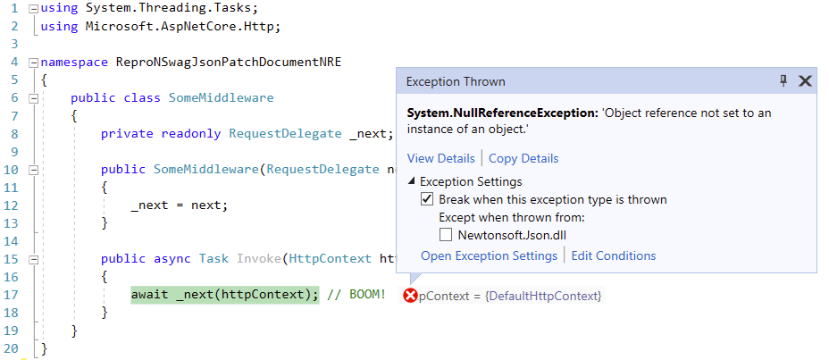

## NSwag: `NullReferenceException` when using `JsonPatchDocument<T>`

I get a `NullReferenceException` if I have any controller receiving a `JsonPatchDocument<T>` instance.




```csharp
[ApiController]
[Route("[controller]")]
public class WeatherForecastController : ControllerBase
{
    [HttpPatch]
    public ActionResult PartialUpdate([FromBody] JsonPatchDocument<UpdateWeatherForecast> update)
    {
        return Ok();
    }
}
```

```csharp
using System.Threading.Tasks;
using Microsoft.AspNetCore.Http;

namespace ReproNSwagJsonPatchDocumentNRE
{
    public class SomeMiddleware
    {
        private readonly RequestDelegate _next;

        public SomeMiddleware(RequestDelegate next)
        {
            _next = next;
        }

        public async Task Invoke(HttpContext httpContext)
        {
            await _next(httpContext); // BOOM!
        }
    }
}
```

### Run the project in Debug Mode (F5)

```
System.NullReferenceException: 'Object reference not set to an instance of an object.'
    Newtonsoft.Json.dll!Newtonsoft.Json.Serialization.DefaultContractResolver.CreateShouldSerializeTest.AnonymousMethod__0(object o)    Unknown
```

Call Stack:

```    
[Lightweight Function]
Newtonsoft.Json.dll!Newtonsoft.Json.Serialization.DefaultContractResolver.CreateShouldSerializeTest.AnonymousMethod__0(object o)
NJsonSchema.dll!NJsonSchema.Generation.JsonSchemaGenerator.GenerateProperties(System.Type type, NJsonSchema.JsonSchema schema, NJsonSchema.Generation.JsonSchemaResolver schemaResolver)
NJsonSchema.dll!NJsonSchema.Generation.JsonSchemaGenerator.GenerateInheritance(Namotion.Reflection.ContextualType type, NJsonSchema.JsonSchema schema, NJsonSchema.Generation.JsonSchemaResolver schemaResolver)
NJsonSchema.dll!NJsonSchema.Generation.JsonSchemaGenerator.GenerateObject(NJsonSchema.JsonSchema schema, NJsonSchema.Generation.JsonTypeDescription typeDescription, NJsonSchema.Generation.JsonSchemaResolver schemaResolver)
NSwag.Generation.dll!NSwag.Generation.OpenApiSchemaGenerator.GenerateObject(NJsonSchema.JsonSchema schema, NJsonSchema.Generation.JsonTypeDescription typeDescription, NJsonSchema.Generation.JsonSchemaResolver schemaResolver)
NJsonSchema.dll!NJsonSchema.Generation.JsonSchemaGenerator.Generate<NJsonSchema.JsonSchema>(NJsonSchema.JsonSchema schema, Namotion.Reflection.ContextualType contextualType, NJsonSchema.Generation.JsonSchemaResolver schemaResolver)
NJsonSchema.dll!NJsonSchema.Generation.JsonSchemaGenerator.Generate<NJsonSchema.JsonSchema>(Namotion.Reflection.ContextualType contextualType, NJsonSchema.Generation.JsonSchemaResolver schemaResolver)
NJsonSchema.dll!NJsonSchema.Generation.JsonSchemaGenerator.GenerateWithReferenceAndNullability<NJsonSchema.JsonSchema>(Namotion.Reflection.ContextualType contextualType, bool isNullable, NJsonSchema.Generation.JsonSchemaResolver schemaResolver, System.Action<NJsonSchema.JsonSchema, NJsonSchema.JsonSchema> transformation)
NSwag.Generation.dll!NSwag.Generation.OpenApiSchemaGenerator.GenerateWithReferenceAndNullability<NJsonSchema.JsonSchema>(Namotion.Reflection.ContextualType contextualType, bool isNullable, NJsonSchema.Generation.JsonSchemaResolver schemaResolver, System.Action<NJsonSchema.JsonSchema, NJsonSchema.JsonSchema> transformation)
NJsonSchema.dll!NJsonSchema.Generation.JsonSchemaGenerator.GenerateArray<NJsonSchema.JsonSchema>(NJsonSchema.JsonSchema schema, NJsonSchema.Generation.JsonTypeDescription typeDescription, NJsonSchema.Generation.JsonSchemaResolver schemaResolver)
NJsonSchema.dll!NJsonSchema.Generation.JsonSchemaGenerator.Generate<NJsonSchema.JsonSchema>(NJsonSchema.JsonSchema schema, Namotion.Reflection.ContextualType contextualType, NJsonSchema.Generation.JsonSchemaResolver schemaResolver)
NJsonSchema.dll!NJsonSchema.Generation.JsonSchemaGenerator.Generate<NJsonSchema.JsonSchema>(Namotion.Reflection.ContextualType contextualType, NJsonSchema.Generation.JsonSchemaResolver schemaResolver)
NJsonSchema.dll!NJsonSchema.Generation.JsonSchemaGenerator.GenerateWithReferenceAndNullability<NJsonSchema.JsonSchema>(Namotion.Reflection.ContextualType contextualType, bool isNullable, NJsonSchema.Generation.JsonSchemaResolver schemaResolver, System.Action<NJsonSchema.JsonSchema, NJsonSchema.JsonSchema> transformation)
NSwag.Generation.dll!NSwag.Generation.OpenApiSchemaGenerator.GenerateWithReferenceAndNullability<NJsonSchema.JsonSchema>(Namotion.Reflection.ContextualType contextualType, bool isNullable, NJsonSchema.Generation.JsonSchemaResolver schemaResolver, System.Action<NJsonSchema.JsonSchema, NJsonSchema.JsonSchema> transformation)
NSwag.Generation.AspNetCore.dll!NSwag.Generation.AspNetCore.Processors.OperationParameterProcessor.AddBodyParameter(NSwag.Generation.Processors.Contexts.OperationProcessorContext context, NSwag.Generation.AspNetCore.Processors.OperationParameterProcessor.ExtendedApiParameterDescription extendedApiParameter)
NSwag.Generation.AspNetCore.dll!NSwag.Generation.AspNetCore.Processors.OperationParameterProcessor.Process(NSwag.Generation.Processors.Contexts.OperationProcessorContext operationProcessorContext)
NSwag.Generation.AspNetCore.dll!NSwag.Generation.AspNetCore.AspNetCoreOpenApiDocumentGenerator.RunOperationProcessors(NSwag.OpenApiDocument document, Microsoft.AspNetCore.Mvc.ApiExplorer.ApiDescription apiDescription, System.Type controllerType, System.Reflection.MethodInfo methodInfo, NSwag.OpenApiOperationDescription operationDescription, System.Collections.Generic.List<NSwag.OpenApiOperationDescription> allOperations, NSwag.Generation.OpenApiDocumentGenerator swaggerGenerator, NSwag.OpenApiSchemaResolver schemaResolver)
NSwag.Generation.AspNetCore.dll!NSwag.Generation.AspNetCore.AspNetCoreOpenApiDocumentGenerator.AddOperationDescriptionsToDocument(NSwag.OpenApiDocument document, System.Type controllerType, System.Collections.Generic.List<System.Tuple<NSwag.OpenApiOperationDescription, Microsoft.AspNetCore.Mvc.ApiExplorer.ApiDescription, System.Reflection.MethodInfo>> operations, NSwag.Generation.OpenApiDocumentGenerator swaggerGenerator, NSwag.OpenApiSchemaResolver schemaResolver)
NSwag.Generation.AspNetCore.dll!NSwag.Generation.AspNetCore.AspNetCoreOpenApiDocumentGenerator.GenerateForControllers(NSwag.OpenApiDocument document, System.Linq.IGrouping<System.Type, System.Tuple<Microsoft.AspNetCore.Mvc.ApiExplorer.ApiDescription, Microsoft.AspNetCore.Mvc.Controllers.ControllerActionDescriptor>>[] apiGroups, NSwag.OpenApiSchemaResolver schemaResolver)
NSwag.Generation.AspNetCore.dll!NSwag.Generation.AspNetCore.AspNetCoreOpenApiDocumentGenerator.GenerateAsync(Microsoft.AspNetCore.Mvc.ApiExplorer.ApiDescriptionGroupCollection apiDescriptionGroups)
NSwag.Generation.AspNetCore.dll!NSwag.Generation.AspNetCore.AspNetCoreOpenApiDocumentGenerator.GenerateAsync(object serviceProvider)
NSwag.AspNetCore.dll!NSwag.AspNetCore.OpenApiDocumentProvider.GenerateAsync(string documentName)
NSwag.AspNetCore.dll!NSwag.AspNetCore.Middlewares.OpenApiDocumentMiddleware.GenerateDocumentAsync(Microsoft.AspNetCore.Http.HttpContext context)
NSwag.AspNetCore.dll!NSwag.AspNetCore.Middlewares.OpenApiDocumentMiddleware.GetDocumentAsync(Microsoft.AspNetCore.Http.HttpContext context)
NSwag.AspNetCore.dll!NSwag.AspNetCore.Middlewares.OpenApiDocumentMiddleware.Invoke(Microsoft.AspNetCore.Http.HttpContext context)
Microsoft.AspNetCore.Routing.dll!Microsoft.AspNetCore.Routing.EndpointMiddleware.Invoke(Microsoft.AspNetCore.Http.HttpContext httpContext)
Microsoft.AspNetCore.Authorization.Policy.dll!Microsoft.AspNetCore.Authorization.AuthorizationMiddleware.Invoke(Microsoft.AspNetCore.Http.HttpContext context)
ReproNSwagJsonPatchDocumentNRE.dll!ReproNSwagJsonPatchDocumentNRE.SomeMiddleware.Invoke(Microsoft.AspNetCore.Http.HttpContext httpContext) Line 17
    at C:\augustoproiete\repro-nswag-jsonpatchdocument-nre\src\ReproNSwagJsonPatchDocumentNRE\SomeMiddleware.cs(17)
Microsoft.AspNetCore.Routing.dll!Microsoft.AspNetCore.Routing.EndpointRoutingMiddleware.SetRoutingAndContinue(Microsoft.AspNetCore.Http.HttpContext httpContext)
Microsoft.AspNetCore.Routing.dll!Microsoft.AspNetCore.Routing.EndpointRoutingMiddleware.Invoke(Microsoft.AspNetCore.Http.HttpContext httpContext)
Microsoft.AspNetCore.Diagnostics.dll!Microsoft.AspNetCore.Diagnostics.DeveloperExceptionPageMiddleware.Invoke(Microsoft.AspNetCore.Http.HttpContext context)
Microsoft.AspNetCore.HostFiltering.dll!Microsoft.AspNetCore.HostFiltering.HostFilteringMiddleware.Invoke(Microsoft.AspNetCore.Http.HttpContext context)
Microsoft.AspNetCore.Hosting.dll!Microsoft.AspNetCore.Hosting.HostingApplication.ProcessRequestAsync(Microsoft.AspNetCore.Hosting.HostingApplication.Context context)
Microsoft.AspNetCore.Server.IIS.dll!Microsoft.AspNetCore.Server.IIS.Core.IISHttpContextOfT<Microsoft.AspNetCore.Hosting.HostingApplication.Context>.ProcessRequestAsync()
Microsoft.AspNetCore.Server.IIS.dll!Microsoft.AspNetCore.Server.IIS.Core.IISHttpContext.HandleRequest()
Microsoft.AspNetCore.Server.IIS.dll!Microsoft.AspNetCore.Server.IIS.Core.IISHttpContext.Execute()
System.Private.CoreLib.dll!System.Threading.ThreadPoolWorkQueue.Dispatch()
System.Private.CoreLib.dll!System.Threading._ThreadPoolWaitCallback.PerformWaitCallback()
```
